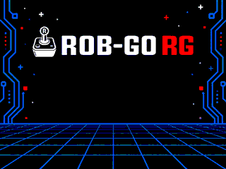

# Retro-Go para RobGo_RG

Emulador MSX/MSX2 para a **RobGo_RG, placa criada por Rodolfo Guerra**, baseada no ESP32 clássico WROVER com PSRAM, saída VGA, cartão SD e teclado/mouse PS/2. A pinagem VGA segue a LilyGO TTGO VGA32 v1.4. Este alvo **não é ESP32-S3**.

**Repositório deste fork:** [EvandroMassini/retro_go_robgo](https://github.com/EvandroMassini/retro_go_robgo). [Releases deste fork](https://github.com/EvandroMassini/retro_go_robgo/releases).

Baseado no [Retro-Go original de ducalex e colaboradores](https://github.com/ducalex/retro-go), commit `4ced120669750ca7228fd0414211430c1d923166`. A documentação original está preservada em [README.upstream.md](README.upstream.md); suas instruções de outras placas não substituem este guia. O repositório mantém outros núcleos do upstream, mas a imagem desta adaptação é composta por **launcher + fMSX**.



Arte de fundo integrada ao launcher, baseada na logo fornecida da RobGo_RG. A imagem acima é o recurso real de 320×240 utilizado pelo firmware. A interface usa tons de azul, texto claro e seleção contrastante; o VGA reduz a arte para as 64 cores disponíveis.

## Índice

- [Primeiros passos](#primeiros-passos)
- [SD, BIOS e bootl.rc](#sd-bios-e-bootlrc)
- [Teclas e navegação](#teclas-e-navegação)
- [Guia completo dos menus](docs/MENUS.md)
- [Imagem, som e desempenho](#imagem-som-e-desempenho)
- [Melhorias e adaptações](#melhorias-em-relação-à-base-e-às-primeiras-revisões)
- [Pinagem](#pinagem)
- [VSCode, PlatformIO, compilação e gravação](BUILDING.md)
- [Estrutura e preparação para publicação](docs/PUBLICACAO.md)
- [Créditos e licenças](#créditos-e-licenças)

## Primeiros passos

1. Use uma RobGo_RG/placa compatível com ESP32 WROVER e PSRAM. Conecte monitor VGA, teclado PS/2 e SD FAT32. Teclado USB com adaptador passivo precisa suportar o protocolo PS/2.
2. Prepare as pastas de BIOS e jogos no SD e, se necessário, o arquivo `bootl.rc` descrito abaixo. BIOS e jogos não são incluídos.
3. Grave a **imagem completa** deste alvo em **0x0**. Um arquivo completo `.img` pode ser copiado/renomeado para `.bin`; isso não se aplica a um aplicativo isolado.
4. Reinicie, selecione MSX no launcher e pressione Enter. Use setas para selecionar uma pasta/jogo e Enter para abrir. Escolha **New game** para começar ou carregar estado quando houver um save compatível.
5. No jogo, F11 abre opções e F12 abre o menu de salvar, carregar, reiniciar e sair. Para retornar ao launcher sem salvar, escolha Quit; para salvar e sair, Save & Quit.

## SD, BIOS e bootl.rc

Exemplo de organização padrão:

```
/bootl.rc
/FMSX/bios/msx/MSX.ROM
/FMSX/bios/msx/MSX2.ROM
/FMSX/bios/msx/MSX2EXT.ROM
/FMSX/bios/msx/DISK.ROM
/FMSX/bios/msx/MSXDOS2.ROM
/FMSX/games/msx/MeuJogo.rom
```

O frontend verifica esses cinco arquivos de BIOS. O núcleo pode procurar ROMs opcionais, como FMPAC.ROM e CMOS.ROM, conforme o modo utilizado. Os nomes devem corresponder aos esperados. Use arquivos que você tenha direito de utilizar.

`bootl.rc` é texto UTF-8 na **raiz do SD**, acessado pelo firmware em `/sd/bootl.rc`. Use barras `/`, sem aspas. Reinicie após editar:

```ini
kbddat=27
kbdclk=26
msx_biosdir=/FMSX/bios
msx_gamedir=/FMSX/games
```

| Parâmetro | Significado e padrão |
|---|---|
| `kbddat` | GPIO DATA do teclado; padrão 32. |
| `kbdclk` | GPIO CLK do teclado; padrão 33. |
| `msx_biosdir` | Diretório das BIOS; padrão `/retro-go/bios/msx`. |
| `msx_gamedir` | Diretório dos jogos MSX; padrão `/retro-go/roms/msx`. O launcher pesquisa subpastas. |

Pares PS/2 aceitos: teclado **DATA32/CLK33**, mouse **DATA27/CLK26** (padrão LilyGO); ou teclado **DATA27/CLK26**, mouse **DATA32/CLK33**. Pares incompletos/inválidos retornam ao padrão. A versão de uso normal não imprime esse diagnóstico na serial. Se o arquivo não existir, é criado com as duas chaves do teclado padrão; as pastas usam seus valores padrão. BOM UTF-8 é aceito; evite UTF-16.

Os caminhos de pastas são relativos à raiz do SD; aceitam `/` inicial ou o prefixo `/sd/`. Sem `msx_biosdir`, o firmware tenta o diretório padrão e, se o conjunto estiver incompleto, a pasta do jogo. Uma pasta explicitamente configurada tem prioridade mesmo que faltem BIOS. Os nomes atuais são **msx_biosdir** e **msx_gamedir**; não use as antigas chaves experimentais `biosdir` ou `msx_romdir`.

Exemplos prontos: [LilyGO](examples/bootl-lilygo.rc) e [RobGo com par alternativo](examples/bootl-robgo.rc). Configurações de menus ficam em `/retro-go/config`; não são parâmetros de `bootl.rc`.

## Teclas e navegação

Os atalhos mudam conforme a tela. Nas tabelas, **confirmar** significa Enter, Enter numérico ou Espaço; **voltar** significa Esc ou Ctrl esquerdo/direito. Essas equivalências valem para a interface; no MSX as teclas também têm suas funções próprias.

### Launcher e lista de jogos

| Tecla | Ação |
|---|---|
| Setas | Na seleção de sistemas, troca de sistema; na lista, cima/baixo move uma linha e esquerda/direita move uma página. |
| Enter / Enter numérico / Espaço | Entra na lista, abre pasta ou abre as ações do jogo selecionado. |
| Esc / Ctrl | Na lista, sobe para a pasta anterior. Na raiz da lista, volta à seleção de sistemas. |
| F9 | Sistema/aba anterior. |
| F10 | Próximo sistema/aba; **não é a tecla de abrir pastas do launcher**. |
| F11 | Opções do launcher. |
| F12 / Magic button | Tela About do launcher. |

As direções do bloco numérico também são aceitas quando o teclado as emite como setas; Num Lock pode alterar os eventos enviados.

### Durante a emulação

| Tecla | Ação |
|---|---|
| F12 / Magic button | Menu Retro-Go do jogo: Save & Continue, Save & Quit, Load game, Reset e Quit. As opções disponíveis dependem do contexto. |
| F11 | Options: Scaling, Filter, Speed e **Emulator options**. |
| F10 | Menu interno do **fMSX**, incluindo seu seletor de arquivos. |
| F9 | Mostra/oculta o teclado virtual do MSX. |
| Setas | Direções do MSX e do joystick emulado; também navegam menus/teclado virtual. |
| Enter / Enter numérico / Espaço | Botão A do controle da interface/joystick; no teclado virtual pressiona a tecla selecionada. Também são enviados como suas teclas MSX. |
| Esc / Ctrl | Botão B do controle da interface/joystick; fecha o teclado virtual. Também mantêm suas funções no teclado MSX. |

Na RobGo, o teclado físico é enviado diretamente à matriz MSX, independentemente do seletor herdado Input=Keyboard/Joystick. Não interprete esse seletor como um bloqueio do teclado físico. **F1 é a tecla F1 do MSX**: pausa somente nos jogos que atribuem essa função a ela. Para suspender a execução enquanto ajusta opções, abra um menu. Atalhos F9–F12 são reservados à interface; não há atalhos especiais implementados para F6–F8.

### Voltar de uma pasta no menu aberto por F10

Esse é um navegador diferente do launcher. **Esc/Ctrl cancela o seletor**, em vez de subir de pasta. Para subir, selecione a entrada **`..`** e pressione Enter, ou use **seta esquerda** dentro do seletor. Esta revisão adiciona `..` explicitamente no ESP32, pois FAT/VFS pode não fornecê-la na listagem. Ela não aparece na raiz `/sd`. A navegação normaliza o caminho ao subir, sem depender de entradas especiais fornecidas pelo cartão.

Para navegação normal, pode-se sair pelo menu F12 → Quit e usar o launcher, onde Esc/Ctrl sobe diretamente de pasta.

### Teclado MSX físico

| Tecla no PC/PS2 | Tecla MSX |
|---|---|
| Letras A–Z, números 0–9 | Letras/números correspondentes; Shift/Caps são interpretados pelo MSX. |
| Shift esquerdo/direito | SHIFT |
| Ctrl esquerdo/direito | CONTROL |
| Alt esquerdo | GRAPH |
| Alt direito | COUNTRY/CODE |
| End | SELECT |
| Pause | STOP |
| Home | HOME |
| Backspace, Tab, Caps Lock | BS, TAB, CAPS LOCK |
| Enter / Enter numérico | ENTER |
| Delete / Insert | DELETE / INSERT |
| Esc / Espaço | ESC / SPACE |
| F1–F5 | F1–F5 do MSX |
| Setas | Cursores do MSX |
| Números do bloco numérico | Teclas numéricas MSX correspondentes. |
| `- = [ ] \ ; ' ` e acento grave, vírgula, ponto, barra | Posições correspondentes do layout US usado pelo frontend. |

O layout físico base é US; os símbolos finais dependem da BIOS e do estado de Shift/GRAPH/CODE. Não há promessa de tradução completa de layout ABNT2. Operadores dedicados do bloco numérico não têm mapeamento próprio nesta revisão.

### Diálogos e entrada de texto da interface Retro-Go

Em diálogos: cima/baixo seleciona; esquerda/direita altera o valor; Enter/Espaço confirma; Esc/Ctrl cancela. F11/F12 também fecham diálogos genéricos. Isso não é necessariamente o comportamento do menu interno do fMSX.

No teclado de texto da interface Retro-Go (distinto do teclado virtual MSX): setas selecionam, Enter/Espaço insere, Esc/Ctrl apaga, F9 alterna layouts/símbolos, F10 conclui, F11/F12 cancela.

## Imagem, som e desempenho

- Saída **VGA64, 320×240 DoubleScan**, com repetição de linhas por DMA e 64 combinações RGB. O sinal ocupa a área ativa do monitor. O launcher sempre desenha seu fundo em tela cheia.
- No jogo, **Scaling=Off** mantém os pixels lógicos da origem. Para o quadro 256×228, há margens de 32 pixels laterais e 6 verticais. O monitor ainda amplia o sinal para o painel. **Fit** preserva proporção; **Full** preenche a área; **Zoom/Factor** permitem ajuste personalizado.
- **Filter=Off** favorece nitidez e menor custo. Filtros podem suavizar pixels, mas não recuperam detalhe inexistente. Modos de 512 pixels/80 colunas não ganharam resolução nativa: o frontend continua com renderização estreita de 256 pixels.
- **F11 → Emulator options → Frame skip**: 0%, 25%, 50%, 75%. Padrão 50%. São quadros que deixam de ser desenhados, não a velocidade pretendida da CPU MSX. Comece em 50%; reduzir pode aumentar fluidez visual e custo.
- CPU ESP32 em 240 MHz, PSRAM em 80 MHz. Emulação no núcleo 0; desenho e áudio no núcleo 1. Áudio tem prioridade acima do desenho e buffer DMA de 45 ms a 32 kHz. Não foi aplicado overclock.
- PSRAM permanece necessária para RAM/VRAM, ROMs e buffers. Não desabilite para tentar ganhar FPS. O áudio é mono no DAC direito GPIO25; GPIO26 é preservado para PS/2.

### Configuração inicial sugerida

Use **Speed=1×**, **Filter=Off**, **Frame skip=50%**, **Auto frame skip=On** e **FM synth=Off** como ponto de partida. O PSG e o SCC continuam ativos com FM desligado. Ative FM em jogos que o utilizem, considerando o custo adicional. Configure Monitor para a proporção física da tela: 4:3, 16:9 ou 21:9.

O ajuste **Monitor** compensa horizontalmente a ampliação do monitor nos modos que preservam proporção; não cria uma nova resolução VGA. **Scaling=Full** deliberadamente preenche a tela e ignora essa compensação. Com Scaling=Off, a imagem do jogo é centralizada; o fundo do launcher continua ocupando a tela inteira. O monitor pode ampliar o sinal VGA recebido: “Off” não significa correspondência 1:1 com os pixels físicos do painel LCD.

A taxa emulada PAL/NTSC e a quantidade de quadros desenhados são medidas diferentes: 60 quadros emulados/s com skip de 50% normalmente resulta em aproximadamente 30 quadros enviados ao vídeo. Auto frame skip pode aumentar o descarte em cenas pesadas para preservar velocidade. Não há garantia de 60 FPS desenhados em todos os jogos MSX2.

### Estado atual do áudio e da serial

A versão normal preserva a cadeia de áudio estável, remove os testes de tom/DMA, captura de áudio e comandos de reinicialização de áudio. Logs de aplicação e mensagens de bootloader estão desativados para este alvo. Uma mensagem curta da ROM interna do ESP32 ainda pode aparecer no reset. Não existe monitor serial periódico de FPS nesta versão.

Nos testes do mantenedor, as interrupções persistiam com uma determinada caixa amplificada de computador, mas desapareceram ao usar headset e também um falante na saída interna da placa. Isso mostra uma dependência da combinação de saída/carga usada no teste; a causa elétrica exata não foi medida. Não se atribui mais esse caso à PSRAM nem se promete compatibilidade elétrica com qualquer caixa. O teste de faixas confirmou canais distintos e branco neutro.

## Melhorias em relação à base e às primeiras revisões

As alterações abaixo descrevem o estado acumulado do fork, não apenas o último binário. Recursos já existentes no Retro-Go/fMSX continuam creditados aos projetos originais.

| Área | Adaptação e benefício |
|---|---|
| Hardware | Novo alvo `robgo-rg` para ESP32 WROVER, VGA e PS/2 da família VGA32; imagem de launcher + fMSX para flash de 4 MB. |
| PS/2 | Inicialização corrigida, leitura física da matriz MSX e restauração de F1–F5; reserva de 4 KiB de RTC para o ULP da FabGL, evitando sobreposição que impedia a captura do teclado. |
| Configuração | `bootl.rc` criado quando ausente, validação dos dois pares teclado/mouse, pastas independentes `msx_biosdir` e `msx_gamedir`. |
| BIOS | Prioridade para diretório explícito; busca alternativa do conjunto completo na pasta do jogo quando a pasta padrão está incompleta. |
| Memória | Buffers auxiliares do fMSX deslocados para PSRAM para liberar memória interna; tratamento dos limites de escrita de vídeo e correções que permitiram iniciar jogos sem o loop de reinício das primeiras revisões. |
| VGA | Ponte FabGL de 64 cores em 320×240 DoubleScan; repetição de linhas por DMA substitui ampliação manual 2×2. Menor uso de framebuffer que a experiência anterior VGA16 em 640×480. |
| Cores | Conversão RGB565 big-endian para RGB222 por tabelas arredondadas; correções de ordem dos bytes e componente azul, incluindo menus internos do fMSX. |
| Desenho | Escrita direta nas linhas VGA, recorte calculado por trecho de linha e submissão de vídeo sem bloquear a emulação esperando uma fila ocupada. |
| Proporção | Scaling do Retro-Go preservado e seleção adicional Monitor 4:3/16:9/21:9, sem alterar sincronismos VGA. |
| Desempenho | CPU em 240 MHz, otimizações direcionadas do compilador, uso dos dois núcleos, frame skip persistente e automático; FM opcional, mantendo PSG/SCC. |
| Áudio | Síntese mono de 32 kHz com acumulador fracionário; fila PCM de 2.560 amostras, envio em blocos de 64, consumo no núcleo 1 com prioridade 7 e I2S por DMA. |
| Continuidade | DMA de 8×180 frames (45 ms); transição curta para silêncio/retomada quando faltam amostras. Volume/mute sincronizados e reconfiguração do driver ao mudar a taxa associada a Speed. |
| Interface | Menus azuis com contraste maior, fundo exclusivo RobGo_RG, correção de `..` no seletor de arquivos F10 e preservação dos menus de salvar/carregar e da navegação do launcher. |
| Simplificação | Removidos menus de teste de áudio, saída experimental, overclock e debug do alvo RobGo. Sem rede/atualizador online na compilação desse alvo; Bluetooth não é habilitado. |
| Operação | Logs serial desativados para uso normal. Não se escreve um buffer contínuo de áudio no SD nem se restaura áudio antigo ao reiniciar. |
| Desenvolvimento | Integração PlatformIO com o build ESP-IDF 4.4.8 existente, tarefas portáveis de VSCode, exemplos do SD, geração de `.bin` completo e manifesto com SHA-256. |

A fila PCM absorve variações curtas de processamento; não elimina uma emulação permanentemente abaixo da velocidade requerida. O tamanho da fila equivale a até 80 ms de PCM, além dos 45 ms do DMA, mas a ocupação real varia. Não foi desabilitada a PSRAM nem aplicado overclock. Testes diagnósticos antigos não fazem parte da interface publicada.

## Pinagem

| Função | GPIO |
|---|---|
| SD CS / MOSI / CLK / MISO | 13 / 12 / 14 / 2 |
| VGA vermelho, bit alto/baixo | 22 / 21 |
| VGA verde, bit alto/baixo | 19 / 18 |
| VGA azul, bit alto/baixo | 5 / 4 |
| VGA HSYNC / VSYNC | 23 / 15 |
| Teclado padrão DATA / CLK | 32 / 33 |
| Mouse padrão DATA / CLK | 27 / 26 |
| Teclado alternativo DATA / CLK | 27 / 26; mouse passa a 32 / 33 |
| Áudio DAC direito | 25 |
| Magic button | 36, ativo baixo, pull-up externo |

**Esta tabela registra o código atual, não todas as revisões físicas da RobGo.** Também foi informado um pinout RobGo com SD MISO=35 e mouse CLK=2. Essa ligação não corresponde ao alvo atual, que usa MISO=2 e CLK do mouse=26 no perfil padrão. Para essa revisão, confira o esquema e adapte `components/retro-go/targets/robgo-rg/config.h` e a seleção PS/2 em `robgo.cpp` antes de compilar. `bootl.rc` não configura SD, VGA nem áudio e não aceita pares PS/2 arbitrários. Não foram alterados os GPIOs funcionais durante a preparação para publicação.

Mouse é encaminhado à porta 0 do frontend; a aplicação MSX e a configuração de emulação precisam suportá-lo. Não houve validação abrangente de mouse. Não habilite DAC esquerdo GPIO26 junto ao PS/2 nesse pino.

## Compilar e gravar

Leia [BUILDING.md](BUILDING.md) para instalar as ferramentas e abrir o projeto no VSCode. Há um `platformio.ini` na raiz: ele utiliza uma **plataforma local que chama o build ESP-IDF 4.4.8 original**, preservando os dois aplicativos e a integração FabGL. Não é uma conversão para Arduino nem instala automaticamente o ESP-IDF.

Após configurar o ambiente:

```sh
pio run -t check
pio run
```

O resultado é `dist/robgo-completo.bin`, acompanhado por `dist/manifest.json`, `launcher.elf` e `fmsx.elf`. O manifesto identifica a versão, tamanho, offsets e SHA-256. A imagem completa contém bootloader, tabela de partições, launcher e fMSX; **não é apenas um arquivo de bootloader**.

No ESP32 Flash Download Tool, selecione ESP32, flash de 4 MB e grave **somente o `.bin` completo em `0x0`**. Para gravar pelo PlatformIO, escolha a porta correta:

```sh
pio run -t upload --upload-port COM5
```

O upload é uma ação explícita: compilar não grava a placa. Não grave o `fmsx.bin` isolado em 0x0. Não use o comando `app-flash` impresso pelo build de cada aplicativo; a tabela provisória de compilação não é a tabela final multiaplicativo.

## Persistência, limitações e solução de problemas

- O SD precisa estar acessível e em FAT32. A mensagem de falha de montagem também pode indicar pinagem ou comunicação; não prova que o formato está incorreto. Um cartão FAT32 de 8 GB não exige uma partição minúscula por regra deste fork.
- BIOS e jogos devem ser fornecidos separadamente. `MSXZ.ROM` em mensagens antigas não é o nome da lista atual: veja os cinco nomes acima.
- Configurações ficam em `/retro-go/config`, estados e dados de jogos em `/retro-go/saves`; capas, favoritos, recentes e cache pertencem ao launcher. Salvar/configurar/navegar pode acessar o SD. O PCM permanece na RAM e DMA, sem arquivo temporário de áudio.
- Save states podem ser incompatíveis entre núcleos/versões. Se Resume falhar, tente New game, preservando uma cópia dos saves antes de removê-los.
- MSX BASIC faz parte das BIOS. Não há um botão dedicado “Boot BASIC” no launcher. O menu F10 permite ejetar cartuchos dos slots A/B e reiniciar a máquina; com BIOS apropriada e sem mídia de autoboot, isso permite chegar ao BASIC. Veja [menus](docs/MENUS.md#basic).
- Wi-Fi, servidor de arquivos, netplay e atualização online não ficam disponíveis neste alvo. Os links de Releases apontam para o fork, mas isso não habilita atualização pela rede.
- VGA possui 64 combinações de cores, sem framebuffer duplo: pode haver tearing e redução dos tons. Modos MSX de 512 pixels não têm saída nativa de 512 pixels nesta versão.
- Mouse e todos os modelos de hardware/MSX2+ não receberam uma matriz completa de testes. A presença de uma opção herdada não garante velocidade total nem compatibilidade de todo software.
- Para relatar problemas, informe versão/SHA-256, placa e revisão, jogo, menus de vídeo/desempenho e `bootl.rc`. Na versão normal não se espera log serial de jogo; fotos ou vídeo podem ajudar. Preserve os ELFs para uma eventual compilação de diagnóstico.

## Créditos e licenças

- **Rodolfo Guerra:** criação da placa RobGo_RG.
- **Evandro Massini:** este fork e validação na placa.
- **ducalex (Alex Duchesne) e colaboradores:** [Retro-Go original](https://github.com/ducalex/retro-go).
- **Marat Fayzullin:** fMSX/EMULib; avisos e condições preservados nos fontes.
- **Fabrizio Di Vittorio e colaboradores:** FabGL; [origem e alterações locais](components/fabgl/UPSTREAM.md), [licença](components/fabgl/LICENSE).

O núcleo fMSX contém avisos que proíbem distribuição comercial e pedem notificação ao autor quando seus arquivos são modificados. FabGL mantém sua licença própria; este conjunto não deve ser apresentado como inteiramente MIT ou como autorização geral de uso comercial.

Preserve [COPYING](COPYING), créditos e licenças das dependências. A licença da raiz não substitui as condições próprias de cada componente. Links de histórico e atribuição em README.upstream.md e CHANGELOG.md foram preservados como referências ao projeto original; não são locais de download deste firmware. Este fork não inclui BIOS/jogos comerciais nem reivindica autoria do código original.
